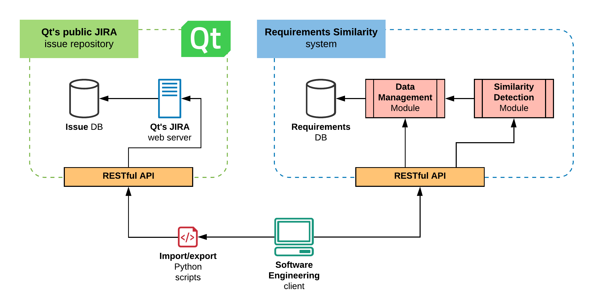
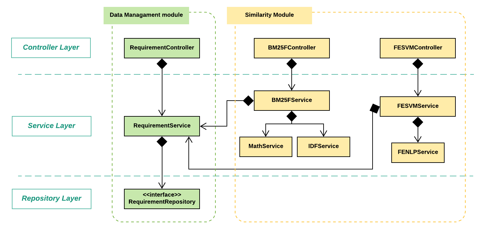

# Requirements Similarity

[](https://www.codefactor.io/repository/github/quim-motger/tfm)

## Table of contents

* [General overview](#general-overview)
* [Used technologies](#used-technologies)
* [How to build](#how-to-build)
* [How to run](#how-to-run)
* [How to use the service](#how-to-use-the-service)
* [Notes for developers](#notes-for-developers)
* [Release](#release)
* [References](#references)
* [License](#license)

## General overview

The Requirements Similarity system is a Java-based web service deployed as a REST API that allows software engineers to test and evaluate similarity algorithms between requirement items in a software engineering (SE) project.

The main purpose of this tool is **to integrate into a decoupled, isolated tool the management of requirements data** in large SE projects **and the evaluation and detection of duplicated requirements**, using natural language and metadata features.

Version 1.0.0 includes the evaluation of two different algorithms:

1. An adaptation of a duplicate detection algorithm based on the BM25F information retrieval algorithm, inspired by [1]

2. An adaptation of a feature extraction process with supervised classification using Support Vector Machine classifiers, inspired by [2]

The system designed is based on a microservice architecture inside the OpenReq project [3], whose goal is *"to build an intelligent decision system for community-driven requirements engineering"*.

## Technical description

### Used technologies

- **Java** *(1.8)*. The main programming language used to develop the service [4].
- **SpringBoot** *(2.2.0)*. It allows to create and manage stand-alone web applications with embedded web services [5].
- **SpringFox** *(2.9.2)*. A framework to automatically generate documentation for the API built with Spring [6].
- **MySQL** *(8.0.18)*. A JDBC driver for managing MySQL databases [7].
- **Apache Lucene** *(7.4.0)*. It provides basic NLP open-source techniques like tokenization and stop-word removal [8].
- **Extended Java WordNet Library** *(2.0.2)*. A Java-based API for creating, reading and updating dictionaries in WordNet format. Used for handling synonyms in syntactic features [9].
- **OpenNLP** *(1.9.1)*. It provides basic NLP open-source techniques like advanced sentence boundary disambiguation [10].
- **StanfordNLP** *(3.6.0)*. It provides advanced NLP techniques like a dependency parser [11].
- **SMILE** *(1.5.3)*. It provides basic classification techniques like support vector machine (SVM) classifiers [12].

### How to build

1. Open command line in `requirements-similarity` root folder

2. Build the project. Generate `jar` file with: ```mvn clean install package```

#### Configure the database

1. Open `{project}/src/main/resources/application.properties` file

2. Change the following properties to your custom values:

```
spring.datasource.url=jdbc:mysql://localhost:3306/requirements_similarity
spring.datasource.username=tfm
spring.datasource.password=UOC-UPC-2019
```

#### Configure the port

1. Open `{project}/src/main/resources/application.properties` file

2. Change the port number to your custom value

```
server.port=9000
```

### How to run

1. Open command line in `requirements-similarity` root folder

2. Navigate to `{project}/target`

3. Run with: ```java -jar requirements-similarity-1.0.0-SNAPSHOT.jar```


### How to use the service

Once the project is running, you can take a look at the Swagger documentation [here](http://localhost:9000/swagger-ui.html/), which includes specific, technical details of the REST API to communicate to the service.*

(\*) *This link will only work if the service is configured to be listening at port 9000. Change the port if needed*

### Notes for developers

The figure below depicts a general overview of the Requirements Similarity system and its integration with the Qt's public Jira issue repository [13], which has been used for algorithmic validation and experimentation purposes.



Concerning the **Requirements Similarity system**, it is built as a decoupled microservice designed in a scalable 3 layer architecture including: interface/controller (RESTful API); service/business logic (modules); and the data layer (requirements DB).

There are two independent modules:

- The **Data Management module** implements all features regarding the requirements management data operations. All read, delete, write and update operations are processed in this module. Additionally, the insert of new requirements is used to apply a basic initial NLP preprocess, which is used by all the algorithms. This basic pipeline includes: Sentence Boundary Disambiguation, Capitalization, Stop Word Removal, Tokenization and Stemming.

- The **Similarity Detection module** develops all domain logic handling the evaluation of requirements similarity algorithms. There are two main components: the BM25FService and the FESVMService. Each one of them implements the features required for each algorithm. Additional classes are designed to extract and decouple some additional features required by each algorithm from the logic of the services.



Software developers that might be interested in extending the system with new algorithms would only require to do the following steps:

1. Implement a new controller class similar to BM25FController and FESVMController, exposing all available features for the new algorithm.

2. Implement a new service class similar to BM25FService and FESVMService which uses the RequirementService to read requirements data. This service class will include all domain-specific logic required by the algorithm.

Concerning the **Qt's public JIRA issue repository**, this project provides additional Python scripts to export issues from this repository and import them to the Requirements Similarity system. Additionally, a list of duplicate and not-duplicate requirements is provided for validation purposes. This information is located under the `{project}/scripts` and the `{project}/json-files` folders respectively.

Concerning the data import/export scripts:

- `export-all.py`	- Export all Qt's public JIRA issues from January 2009 to November 2019 and stores them in a JSON file
- `load_requirements.py` - Import all requirements in the `export-all.py` output file to a local instance of the Requirements Similarity service

Additional scripts for study and validation purposes are provided

Concerning the data files:

- `requirement-pairs.json` - Contains a list of requirement pairs from the Qt's public JIRA repository which are identified as duplicates (1436) and not-duplicates (1499)

Additionally, 3 OpenReq JSON instances for testing and usage purposes are provided at `src/main/resources/request_examples`. These files are:

- `requirementsAndProjects.json` - A JSON file in the OpenReq Schema containing a subset of the requirements and projects used for the validation

- `duplicates.json` - A JSON file in the OpenReq Schema containing a subset of the duplicate and not-duplicate relations used for the validation

- `OpenReqSchema.json` - A JSON file in the OpenReq Schema containing the requirements, the projects and the duplicates in the previous files

### Release

A stable release (v1.0) is published at: https://github.com/quim-motger/tfm/releases/tag/v1.0

This release includes a .zip file with a runnable jar to deploy and test the tool, with the required models and files.

### Sources

[1] Sun, C., Lo, D., Khoo, S. C., & Jiang, J. (2011). Towards more accurate retrieval of duplicate bug reports. 2011 26th IEEE/ACM International Conference on Automated Software Engineering, ASE 2011, Proceedings, 253–262. https://doi.org/10.1109/ASE.2011.6100061

[2] Mahajan, R. S., & Zaveri, M. A. (2017). Machine learning based paraphrase identification system using lexical syntactic features. 2016 IEEE International Conference on Computational Intelligence and Computing Research, ICCIC 2016. https://doi.org/10.1109/ICCIC.2016.7919721

[3] Requirements Engineering - Tools and Solutions Offered by OpenReq. OpenReq. https://openreq.eu/.

[4] “Java SE Runtime Environment 8 Downloads.” Java SE Runtime Environment 8 - Downloads. https://www.oracle.com/technetwork/java/javase/downloads/jre8-downloads-2133155.html.

[5] “Spring Projects.” Spring. https://spring.io/projects/spring-boot.

[6] “SpringFox.” SpringFox by springfox. http://springfox.github.io/springfox/.

[7] MySQL. https://www.mysql.com/.

[8] Apache Lucene Core. https://lucene.apache.org/core/

[9] Extended Java WordNet Library. http://extjwnl.sourceforge.net/

[10] Team, The Apache OpenNLP. “Welcome to Apache OpenNLP.” Brand. https://opennlp.apache.org/.

[11] “The Stanford NLP Group.” The Stanford Natural Language Processing Group. https://nlp.stanford.edu/.

[12] Statistical Machine Intelligence & Learning Engine. https://github.com/haifengl/smile.

[13] System Dashboard - Qt Bug Tracker. https://bugreports.qt.io/secure/Dashboard.jspa

## License

Free use of this software is granted under the terms of the [EPL version 2 (EPL2.0)](https://www.eclipse.org/legal/epl-2.0/)
